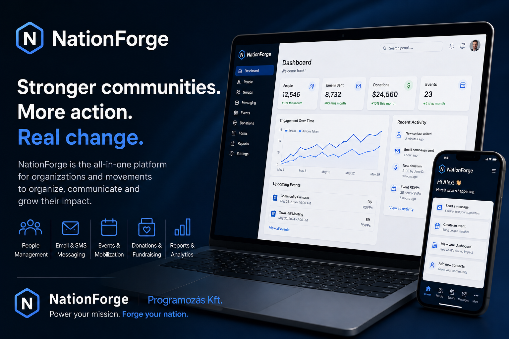

<h1 align="center">
  <br>
  NationForge
  <br>
</h1>

<p align="center">
  <strong>Community & Political Organization Management Platform</strong><br>
  Built with Laravel 12 · Livewire 3 · Spatie Permission
</p>

<p align="center">
  
  
  
  
</p>

<p align="center">
  
</p>

---

## What is NationForge?

NationForge is an open-core platform built for **political movements, civic organizations, and community groups** to manage their operations from a single, self-hosted admin panel.

Running an organization means juggling hundreds of contacts, events, volunteers, donors, and internal communication — all at once. Generic CRMs are expensive and built for sales teams, not communities. NationForge is purpose-built for the way civic organizations actually work.

**Own your data. Host it yourself. Extend it freely.**

---

## Features

> ✅ = implemented &nbsp;·&nbsp; 🔲 = planned

### Contacts (CRM)
- ✅ Full people database: name, status, address, phone, email, birthdate, gender, social links
- ✅ Status workflow: **Prospect → Supporter → Member → Volunteer → Donor → VIP → Inactive**
- ✅ Photo upload (Spatie MediaLibrary)
- ✅ Newsletter subscription management + unsubscribe token
- ✅ Custom fields (JSON), source tracking, notes, biography
- ✅ Donation statistics per contact (total donated, count, last donation date)
- ✅ Group membership & event RSVP history
- ✅ Soft deletes
- ✅ CSV / Excel import & export
- ✅ Advanced saved filters & search with named presets
- ✅ Duplicate detection & contact merge
- ✅ Per-contact activity log (interaction history)
- ✅ Contact scoring / lead scoring (6-stage pipeline + 1–5 stars)

### Groups
- ✅ Types: Community, Campaign, Chapter, Committee, Team
- ✅ Privacy levels: Public / Private / Secret
- ✅ 28 custom icons per group
- ✅ Cover image, member list with role badges
- ✅ Built-in **real-time group chat** (Livewire)
- ✅ Soft deletes
- 🔲 File sharing within groups
- 🔲 Group-level calendar

### Events
- ✅ Types: Meetup, Rally, Webinar, Fundraiser, Volunteer, Conference
- ✅ Online & offline support (venue/city + online URL)
- ✅ Capacity management, ticket pricing fields
- ✅ RSVP tracking per event
- ✅ **Public event registration page** (name, email, phone, guests, notes, token)
- ✅ Status workflow: Draft → Published → Completed / Cancelled
- ✅ Cover image, featured flag, tags, soft deletes
- 🔲 Registration confirmation email (automatic after sign-up)
- 🔲 Volunteer shift scheduling (model ready, UI pending)
- 🔲 Event check-in via QR code
- 🔲 Online payment for paid tickets (Stripe / Barion)
- 🔲 Waitlist management

### Email Campaigns
- ✅ Compose and send HTML / Markdown email campaigns
- ✅ Sender name & email configurable per campaign
- ✅ Delivery tracking: sent count, failed count, recipient count
- ✅ Status workflow: Draft → Sending → Sent / Failed
- ✅ Powered by [Resend](https://resend.com) transactional email API
- 🔲 Email template library (reusable layouts)
- 🔲 Audience segmentation (send to group / tag / status)
- 🔲 Automated drip / sequence campaigns
- 🔲 One-click unsubscribe landing page
- 🔲 Open & click tracking

### Donations
- ✅ Donor records linked to contacts (or anonymous)
- ✅ Amount, currency, payment status, payment method, transaction ID
- ✅ Per-campaign tracking label
- ✅ Monthly donation totals on dashboard
- ✅ Recurring donation fields (interval, next charge date)
- 🔲 Public online donation form
- 🔲 Donation receipt / acknowledgment email
- 🔲 Export for accounting (CSV, PDF)

### Projects & Tasks
- ✅ Project management: title, status, priority, start/end date
- ✅ Assigned team members (many-to-many)
- ✅ Overdue detection & progress percentage (based on tasks)
- ✅ Task list with status and deadlines per project
- 🔲 Task comments & file attachments
- 🔲 Gantt-style timeline view

### Dashboard
- ✅ Stat cards: total contacts, upcoming events, donation totals, newsletter subscribers
- ✅ **Chart.js charts**: monthly donations (bar), contact growth (dual-axis line), status distribution (doughnut)
- ✅ Upcoming events panel, latest contacts feed
- 🔲 Custom dashboard widget builder
- 🔲 Scheduled summary reports via email

### Users & Roles
- ✅ Role-based access control: **Super Admin, Admin, Editor, Member**
- ✅ Powered by [Spatie Laravel Permission](https://github.com/spatie/laravel-permission)
- ✅ User photo upload
- ✅ Users assignable to groups with roles
- 🔲 Audit log (who changed what, when)
- 🔲 Invitation-based user registration

### Link Collection & Quick Links
- ✅ Configurable link library for the whole team (social media, news, resources)
- ✅ Custom colors, sort order, category grouping
- ✅ Quick links bar in top navigation
- ✅ Managed from Settings — no code needed

### Settings
- ✅ App name, mail from address / name configurable from admin UI
- ✅ Changes written directly to `.env`
- 🔲 Branding settings (logo, colors, org name)
- 🔲 SMTP / mailer configuration from UI

### Help & Documentation
- ✅ Built-in help article editor (Markdown-like, bilingual HU/EN)
- ✅ Image lightbox support
- ✅ Accessible to all users from the admin panel
- 🔲 Video embed support in help articles

### Multi-language
- ✅ Full HU / EN bilingual admin panel
- ✅ Language switcher in sidebar (SVG flag-icons)
- ✅ Per-session locale switching
- 🔲 Additional language packs (DE, RO, SK, …)

### Integrations & API
- 🔲 Webhook support (outgoing events)
- 🔲 Google Calendar sync
- 🔲 Facebook Events sync
- 🔲 Zapier / Make (Integromat) integration

### Advanced / Enterprise
- 🔲 Multi-organization / Multi-tenant support
- 🔲 White-label & custom domain per tenant
- 🔲 Advanced reporting & data export
- 🔲 Two-factor authentication (TOTP)
- 🔲 REST API for mobile clients
- 🔲 Document storage (files per contact / project)
- 🔲 Survey & form builder
- 🔲 Petition / signature collection
- 🔲 Volunteer hours tracking
- 🔲 Priority support & SLA
- 🔲 Managed cloud hosting

---

## Tech Stack

| Layer | Technology |
|---|---|
| Backend | PHP 8.2+, Laravel 12 |
| Templating | Blade |
| Reactivity | Livewire 3 + Volt |
| Auth | Laravel Breeze |
| Roles & Permissions | Spatie Laravel Permission |
| Media | Spatie Laravel MediaLibrary |
| Charts | Chart.js 4.4 |
| CSS | Tailwind CSS |
| Database | MySQL 8+ / SQLite |

---

## Requirements

- PHP >= 8.2
- Composer 2
- Node.js >= 18 + NPM
- MySQL 8+ (or SQLite for local development)

---

## Installation

```bash
# 1. Clone the repository
git clone https://github.com/programozas-kft/nationforge.git
cd nationforge

# 2. Install PHP & JS dependencies
composer install
npm install

# 3. Set up environment
cp .env.example .env
php artisan key:generate

# 4. Configure database in .env
# DB_DATABASE=nationforge
# DB_USERNAME=root
# DB_PASSWORD=

# 5. Run migrations & link storage
php artisan migrate
php artisan storage:link

# 6. Build frontend assets
npm run build
```

Or use the one-command setup:

```bash
composer run setup
```

### Create your first admin user

```bash
php artisan tinker
```
```php
$user = User::create(['name' => 'Admin', 'email' => 'admin@example.com', 'password' => bcrypt('password')]);
$user->assignRole('super-admin');
```

---

## Local Development

```bash
composer run dev
```

Starts the Laravel server, Vite, queue listener and log watcher concurrently.

---

## Open Core Model

NationForge follows an **Open Core** strategy — the community foundation is MIT-licensed and free forever, while advanced enterprise features are available in the Pro tier.

> The Community / Pro split is being finalized. See the [Features](#features) section above for the full list (✅ done, 🔲 planned). The table below will be updated once the split is confirmed.

| Feature | Community (this repo) | [Pro / Enterprise](https://github.com/programozas-kft/nationforge-pro) |
|---|:---:|:---:|
| Full source code | ✅ | ✅ |
| Contacts, Groups, Events | ✅ | ✅ |
| Donations, Projects, Tasks | ✅ | ✅ |
| Built-in chat | ✅ | ✅ |
| Email campaign sender | ✅ | ✅ |
| Multi-language (HU/EN) | ✅ | ✅ |
| CSV / Excel import & export | ✅ | ✅ |
| Advanced filters & saved presets | ✅ | ✅ |
| Duplicate detection & merge | ✅ | ✅ |
| Activity log per contact | ✅ | ✅ |
| Lead scoring (pipeline + stars) | ✅ | ✅ |
| Advanced analytics & reports | — | ✅ |
| Multi-organization / Multi-tenant | — | ✅ |
| White-label & custom domain | — | ✅ |
| Two-factor authentication (TOTP) | — | ✅ |
| REST API for mobile clients | — | ✅ |
| Document storage | — | ✅ |
| Survey & form builder | — | ✅ |
| Petition / signature collection | — | ✅ |
| Volunteer hours tracking | — | ✅ |
| Priority support & SLA | — | ✅ |
| Managed cloud hosting | — | ✅ |

> **Interested in Pro or managed hosting?**
> → [View NationForge Pro](https://github.com/programozas-kft/nationforge-pro) · [programozas.kft@gmail.com](mailto:programozas.kft@gmail.com)

---

## Contributing

Pull requests are welcome for bug fixes, UI improvements, and translations.

1. Fork the repository
2. Create your branch: `git checkout -b fix/your-fix`
3. Commit: `git commit -m "Fix: description"`
4. Push and open a Pull Request

For larger features, **please open an Issue first** so we can discuss direction before you invest the time.

---

## Security

If you discover a security vulnerability, please email [programozas.kft@gmail.com](mailto:programozas.kft@gmail.com) instead of opening a public issue. All reports are addressed promptly.

---

## License

The NationForge Community Edition is released under the **[MIT License](LICENSE)**.

---

<p align="center">
  Built with Laravel ·
  <a href="https://github.com/programozas-kft/nationforge/issues">Report a Bug</a> ·
  <a href="https://github.com/programozas-kft/nationforge/discussions">Discussions</a> ·
  <a href="mailto:programozas.kft@gmail.com">Contact</a>
</p>
